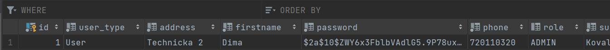

# 🏆 SportHub
SportHub is a specialized application for managing sports clubs, including their training sessions and competitions. The application is designed to simplify the organization and management of sports club activities, such as tracking membership, recording payments, and managing participation in competitions.

# 📌 Features (below are the screenshots)

- **🏅 Member Management**: Register, edit, and remove club members, including their names, addresses, and phone numbers.

- **💳 Membership Payments**: Keep records of annual membership payments.

- **🎯 Competition Tracking**: Record participation in competitions and assign points to participants.

- **🔐 User Authentication and Roles**: Implement user authentication with role-based access control (User, Administrator).

# 📌 Technologies Used

- **Spring Boot** (for application development)

- **Spring Security** (for authentication and access control)

- **PostgreSQL** (for database management)

- **Maven** (for dependency management)

- **Named Queries** (@NamedQuery)

- **Ordering** (@OrderBy)

- **Cascading Remove** (CascadeType.REMOVE)

# 📌 Application Structure

The project is implemented in Java using Maven, Spring Boot, and Spring Security. It utilizes PostgreSQL as the relational database.

📂 Package Organization:

- **Model**: Contains classes representing the data model of the application.

- **DAO (Data Access Object)**: Manages data access and interaction with the database.

- **Service**: Implements the business logic of the application.

- **Rest**: Defines controllers for handling RESTful API requests and responses.

- **Security**: Ensures application security and user authentication.

- **Exception**: Handles errors and custom exceptions.

# 📌 Configuration & Execution

🚀 Main Executable File: ClubEvidenceApplication.java – contains the main entry point of the application.

🛠️ Configuration File: application.yaml – contains database connection settings.

🏦 Database Connection: The application requires a configured database (credentials are set in application.yaml).

# 📌 Screenshots
1. After starting the application, an administrator is automatically created.  

     

2. The administrator appears in the table.  

     

3. We verify that the admin is indeed present using the "Get All Users" request, and there they are.  

     

4. Next, we need to register to be able to make further changes (remove/add/update user).  

     

5. We made changes to our admin, and after using "Get All Users," we can see that the changes were applied.  

     
     

6. Now, we want to add more members.  

     

7. We verify, and the member has been added.  

     
     

8. Now, we want to delete a member (member with ID number 2).  

     

9. We check again, and the member is no longer there.  

     
     

# UML CLass Diagram
     

### 🔑 Default Admin Account:

Username: 1111

Password: adm1n

# 🚀 How to Run the Project in IntelliJ IDEA

  1. Clone the repository

`git clone https://github.com/voropali1/SportHub.git`

  2. Open the project in IntelliJ IDEA

  3. Configure the database connection in application.yaml.

  4. Run the application:

      Open ClubEvidenceApplication.java

      Click Run ▶️ in IntelliJ IDEA.

  5. Access the application

      Use the admin credentials provided above to log in.
